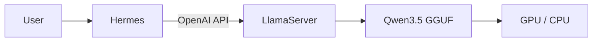
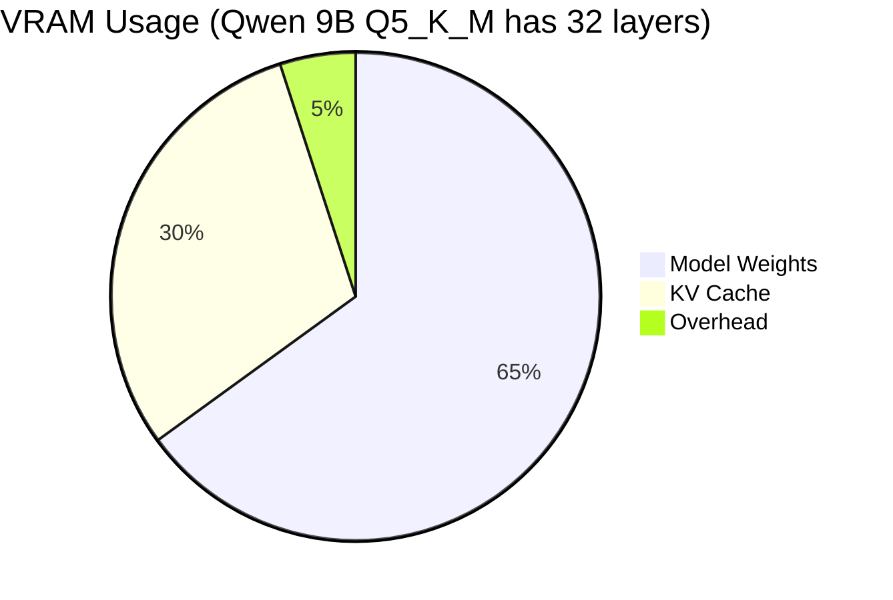
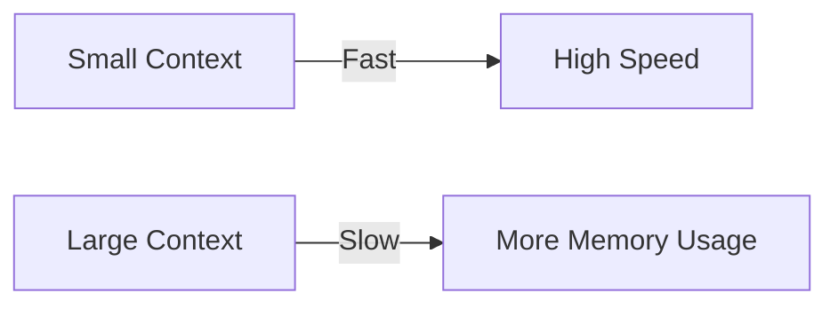
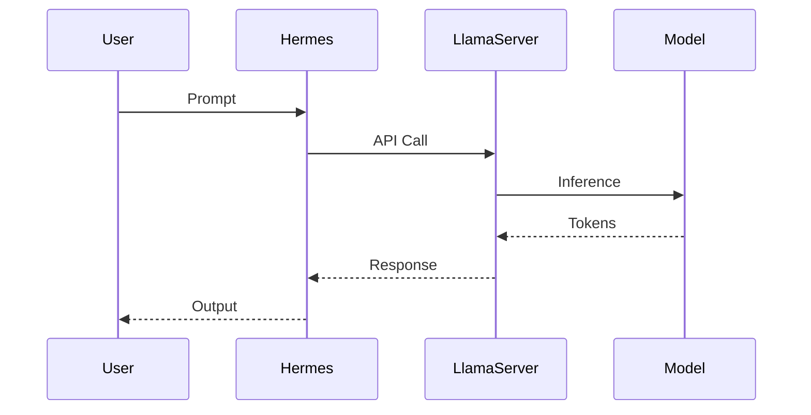

# Hermes Agent + llama.cpp + Qwen3.5 Integration Guide


**Author:** Antonio Martinez
**Date:** March 18, 2026

> End-to-end setup for running **Hermes Agent + llama.cpp + Qwen3.5** locally with GPU acceleration.

---

# ?? Table of Contents

* [System Requirements](#-system-requirements)
* [Architecture Overview](#-architecture-overview)
* [Prerequisites & Setup](#-prerequisites--setup)
* [Hermes Agent Installation](#-hermes-agent-installation)
* [llama.cpp Installation](#-llamacpp-installation)
* [Model Setup (Qwen3.5)](#-model-setup-qwen35)
* [Running the Server](#-running-the-server)
* [Usage Examples](#-usage-examples)
* [Performance & Memory](#-performance--memory)
* [Troubleshooting](#-troubleshooting)
* [Optimization Tips](#-optimization-tips)
* [Best Practices](#-best-practices)

---

# ??? System Requirements

| Component | Minimum        | Recommended      |
| --------- | -------------- | ---------------- |
| GPU       | GTX 1060 (6GB) | RTX 30/40 series |
| VRAM      | 6GB            | 12GB+            |
| RAM       | 16GB           | 32GB             |
| CPU       | 4 cores        | 8+ cores         |
| OS        | Linux / WSL2   | WSL2/ Ubuntu 22.04     |

---

# ?? Architecture Overview



---

# ?? Prerequisites & Setup

```bash
sudo apt update && sudo apt upgrade -y
sudo apt install -y build-essential cmake git curl wget htop
```

### Verify GPU

```bash
nvidia-smi
```

```bash
nvcc --version
```

If both commands works continue with Hermes agent installation, if don't, then you need CUDA Toolkits:

## CUDA Toolkits for WSL - Ubuntu

check: [Link](https://developer.nvidia.com/cuda-downloads?target_os=Linux&target_arch=x86_64&Distribution=WSL-Ubuntu&target_version=2.0&target_type=deb_local)

Also, may have to install nvcc with: 

```bash
sudo apt install nvidia-cuda-toolkit
```

---

# ?? Hermes Agent Installation

```bash
curl -fsSL https://raw.githubusercontent.com/NousResearch/hermes-agent/main/scripts/install.sh | bash
```

### Config

```bash
hermes config create --provider llama-cpp
nano ~/.hermes/config.yaml
```

```yaml
OPENAI_BASE_URL: http://localhost:8080/v1
OPENAI_API_KEY: dummy
LLM_MODEL: Qwen3.5-9B-Q5_K_M
```

---

# ?? llama.cpp Installation

## Recommended Path

```bash
sudo mkdir -p /opt/llama.cpp
sudo chown -R $USER:$USER /opt/llama.cpp

cd /opt/llama.cpp
git clone https://github.com/ggerganov/llama.cpp.git .
```

## Build with CUDA

```bash
cmake -B build -DGGML_CUDA=ON
cmake --build build --config Release
```

Note:

remove any previous failed build with:

```bash
rm -rf build
```

## Verify

```bash
./build/bin/llama-server -h
```

---

# ?? Model Setup (Qwen3.5)

This will be created at your home directory

```bash
mkdir -p ~/models
cd ~/models

wget https://huggingface.co/unsloth/Qwen3.5-9B-GGUF/resolve/main/Qwen3.5-9B-Q5_K_M.gguf?download=true
```

## Notes

### Model Sizes Comparison

| Model | Parameters | Q4_K_M | Q5_K_M | Q5_K_L | Q6_K_L |
|-------|------------|--------|--------|--------|--------|
| **Qwen3.5 9B** | 9B | 5.5GB | 6.5GB | 6.8GB | 7.7GB |
| **Qwen3.5 14B** | 14B | 9.0GB | 10.5GB | 11.0GB | 12.5GB |

### Model Selection Matrix

| Use Case | Model | Quantization | VRAM | Speed | Precision Loss |
|----------|-------|--------------|------|-------|-----------------|
| **General Chat** | Qwen3.5 9B | Q4_K_M | 5.5GB | 35-50 tok/s | ~7-8% |
| **Development** | Qwen3.5 9B | Q5_K_M | 6.5GB | 28-42 tok/s | ~4-5% |
| **Research** | Qwen3.5 9B | Q5_K_L | 6.8GB | 22-35 tok/s | ~3-4% |
| **Complex Tasks** | Qwen3.5 14B | Q4_K_M | 9.0GB | 25-40 tok/s | ~7-8% |
| **Maximum Quality** | Qwen3.5 14B | Q5_K_M | 10.5GB | 22-35 tok/s | ~4-5% |

---

# ?? Running the Server

```bash
/opt/llama.cpp/build/bin/llama-server \
  -m ~/models/Qwen3.5-9B-Q5_K_M.gguf \
  -c 8192 \
  -ngl 32 \
  --threads 8 \
  -fa on \
  --host 127.0.0.1 \
  --port 8080
```

---

# ?? Usage Examples

## API (OpenAI Compatible)

```bash
curl http://localhost:8080/v1/completions \
  -H "Content-Type: application/json" \
  -d '{
    "prompt": "Write a Python function",
    "max_tokens": 128
  }'
```

---

## CLI

```bash
/opt/llama.cpp/build/bin/llama-cli \
  -m ~/models/Qwen3.5-9B-Q5_K_M.gguf \
  -ngl 32 \
  -c 4096 \
  -i
```

### Recommended Commands (For a 12 GB VRAM)

#### Qwen3.5 9B - General Purpose (Recommended)

```bash
./llama.cpp/build/bin/llama-server \
    -m /home/antonio/models/Qwen3.5-9B-Instruct-Q5_K_M.gguf \
    -c 8192 -n 4096 -ngl 32 \
    --port 8080 \
    --host 0.0.0.0 \
    --threads 8 \
    --flash-attn 1 \
    --cache-type-k q4_0
```

#### Qwen3.5 14B - Complex Reasoning

```bash
./llama.cpp/build/bin/llama-server \
    -m /home/antonio/models/Qwen3.5-14B-Q4_K_M.gguf \
    -c 131072 -n 4096 -ngl 34 \
    -np 1 -fa on \
    --port 8080 \
    --host 0.0.0.0 \
    --threads 8 \
    --flash-attn 1 \
    --cache-type-k q4_0 
```

#### Qwen3.5 9B - Maximum Speed

```bash
./llama.cpp/build/bin/llama-server \
    -m /home/antonio/models/Qwen3.5-9B-Instruct-Q4_K_M.gguf \
    -c 4096 -n 2048 -ngl 32 \
    --port 8080 \
    --host 0.0.0.0 \
    --threads 12 \
    --flash-attn 1 \
    --cache-type-k q4_0 
```

## Integration with Hermes Agent

```bash
# Option A: Hermes using CLI
hermes chat --model qwen3.5-9B_Q5_K_M

# Option B: Using Telegram
hermes gateway
```

---

# ?? Performance & Memory

## Memory Breakdown



---

## KV Cache Rule

* ~1.2 GB per **4096 tokens**
* Scales linearly with context

| Context | KV Cache |
| ------- | -------- |
| 4096    | ~1.2 GB  |
| 8192    | ~2.4 GB  |
| 10240   | ~3.0 GB  |

---

## Important

* KV cache = **input + output tokens**
* Total tokens = `-c (llama.cpp flag)`

## Tips

### RAM Calculation

Each LLM Transformer layer needs around ~180–320 MB por layer (model-dependent, rough estimate) of VRAM (For GPU) / RAM (for CPU) depending of the Quantization.
 - Q4_K_M: would be around 200MB per Layer.
 - Q5_K_M: Would be around 300MB per Layer.
 
Every 4096 tokens will need a KV Cache equivalent to ~1.2GB VRAM / RAM

System + Overhead will required 0.5GB of VRAM/ RAM

Doing some math example for QWEN3.5-9B-Q5_K_M.gguf:

| Component | VRAM Required (Q5_K_M) |
|------------|-------------------------|
| Model weights (32 layers) | ~9.4 GB |
| KV Cache (Context 4096) | ~1.2 GB |
| System + overhead | ~0.5 GB |
| **Total** | **~11.1 GB** |

A little tight for a 12GB VRAM GPU, but totally functional. 

Now, depending of the task, you may need to have more context, let's says 8192 tokens of context, you can sacrifice some inference speed by loading less layers on the GPU:

| Component | VRAM Required (Q5_K_M) |
|------------|-------------------------|
| Model weights (28 layers) | ~8.2 GB |
| KV Cache (Context 8192) | ~2.4 GB |
| System + overhead | ~0.5 GB |
| **Total** | **~11.1 GB** |

As you have more GPU VRAM available, you could try add even more context (2048 more):

| Component | VRAM Required (Q5_K_M) |
|------------|-------------------------|
| Model weights (28 layers) | ~8.2 GB |
| KV Cache (Context 10240) | ~3.0 GB |
| System + overhead | ~0.5 GB |
| **Total** | **~11.7 GB** |

But you will have only 2.5% of the GPU free, is always recommended to have 5%.

KV cache memory depends on the total active context (-c), not separately on input or output tokens.

Note: QWEN3.5-14B has 40 Layers.

### Additional Parameters for llama.cpp

| Parameter | Value | Description |
|-----------|-------|-------------|
| `-c` | 8192 | Context size (text length, max buffer) |
| `-n` | 4096 | Max output tokens |
| `--ngl` | 32 | Layers on GPU (depends of LLM used) |
| `--port` | 8080 | Server port |
| `--host` | 0.0.0.0 | Listen on all interfaces |
| `--threads` | 8 | CPU threads for parallelization |
| `--flash-attn` | 1 | Enable Flash Attention (speed boost) |

---

# ?? Troubleshooting

## CUDA Out of Memory

```bash
-ngl 28
-c 4096
```

---

## Slow Performance

```bash
--threads 12
-fa on
```

---

## GPU Not Detected

```bash
nvidia-smi
wsl --update
```

---

# ? Optimization Tips

## Context vs Performance



---

## Best Flags

```bash
-c 8192
-ngl 32
-fa on
--threads 8
```

---

# ?? Best Practices

## Model Strategy

| Use Case | Model             |
| -------- | ----------------- |
| Chat     | Qwen3.5 9B Q4_K_M |
| Dev      | Qwen3.5 9B Q5_K_M |
| Research | Qwen3.5 9B Q5_K_L |
| Complex  | Qwen3.5 14B       |

---

## Security

```bash
chmod 700 ~/models
chmod 755 /opt/llama.cpp/build/bin/llama-server
```

* Use `127.0.0.1`
* Do NOT expose publicly

---

# ?? Workflow



---

# ? Production Checklist

* [ ] GPU working (`nvidia-smi`)
* [ ] llama.cpp built with CUDA
* [ ] Model downloaded
* [ ] Server running
* [ ] Hermes connected
* [ ] Context optimized
* [ ] Permissions secured

---

# ?? Resources

* llama.cpp ? [https://github.com/ggerganov/llama.cpp](https://github.com/ggerganov/llama.cpp)
* Hermes Agent ? [https://hermes-agent.nousresearch.com/](https://hermes-agent.nousresearch.com/)
* Qwen Models ? [https://huggingface.co/Qwen](https://huggingface.co/Qwen)

---